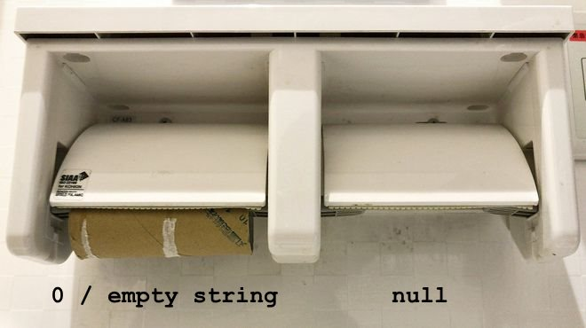

# Lesson 2

1. [The browser console displays text](#console)
2. [Tie strings together using +](#concat)
3. [Functions can return a value after executing](#return)
4. [There are different kinds of blank values](#blank)
5. [Conditional statements can have multiple/complex conditions](#condition)
6. [Not all text can be parsed to a number](#nan)
7. [Variables can retain their value by being in the global scope](#global)
8. [Be disciplined with your code organization](#organize)
9. [Button](#project)

### The browser console displays text for errors and testing <a name="console"></a>

When computers were young their screens would pretty much just display text. The user would type in some text and the computer would respond with text (think 
[DOS](https://en.wikipedia.org/wiki/DOS)). Over the years that concept never disappeared because it's still useful and often times necessary. In a browser 
the special place for text output is called the [console](https://developer.mozilla.org/en-US/docs/Tools/Browser_Console). This is where warnings and errors are displayed, 
and it's available for you to send text for testing and debugging. In order to print text to the console use the function `console.log()` 
with your string/variable/expression passed inside:

```javascript
console.log("Hello there");
```

You can test this using the [p5 online editor](https://editor.p5js.org/) by entering it into `setup()`. Press F12 to view the console, or right click on the page and select 
[Inspect Element](https://www.lifewire.com/get-inspect-element-tool-for-browser-756549), then choose the tab that says Console. After the code above runs the console 
should say `Hello there` without the quotes. The web editor also displays its own console so you don't need to open the browser's.

You probably noticed the period `.` separating `console` and `log()`. This is called [dot notation](https://developer.mozilla.org/en-US/docs/Web/JavaScript/Reference/Operators/Property_Accessors) 
because `console` is an Object and `log()` is a function inside that Object. For now don't worry too much about it.

And on the topic of getting messages from your browser there's also the function `alert()`. This function will immediately display a small popup window 
with a message and an OK button. It's simply for sending a quick message to the user. The message to display, like with `console.log()`, is passed into the function, and both
are from the [Standard Library](https://developer.mozilla.org/en-US/docs/Web/JavaScript/Reference/Global_Objects). It's not used often in modern websites 
because it pauses the entire website until the user clicks OK. 

```javascript
alert("Well hello"); //show popup
```

<br/>

### Tie strings together using + <a name="concat"></a>

We've already seen `+` as the arithmetic operator for addition. JavaScript also uses `+` to append/concatenate strings together. It's useful when you need to combine 
a message with a variable, or for any other time you need strings or numbers jammed together. 

```javascript
let name = "Bob";
console.log("Hello " + name);

let x = 5;
console.log("The value of x is " + x);
```

In the second example `x` is a number but the output will still be `The value of x is 5`. This is because JavaScript looks for context to know how to interpret some symbols. It sees that
to the left of the `+` is a string so it automatically converts `x` to a string. If instead both sides of the `+` were numbers it would add them together.

```javascript
let y = 10;
console.log(y); //prints 10
console.log(y + 5); //prints 15
```

If you want to do some arithmetic *and* concatenation you can place the math inside parentheses. You can do any kind of arithmetic inside, not just addition.

```javascript
let z = 100;
console.log("Some sum " + (z + 1)); //prints Some sum 101
console.log("One quarter is " + (z / 4)); //prints One quarter is 25
```

<br/>

### Functions can return a value after executing <a name="return"></a>

We've already learned a handul of functions from both Processing and the Standard Library. You call the function, it does some work, and the program continues. 
Some functions however will result in a value after executing. Not only do they perform work but they package up a value and hand it back after being called. 
This is known as *returning*. We won't be creating our own functions yet but we will learn about a few that do return a value. 

So how do you know which functions will return a value and which will not? Well it's really something you have to learn on a case by case basis, although generally if a function
returns a value it will have a name to help indicate that. So far none of the functions we've learned return anything. 

Two functions from the Standard Library that return a value are [`parseInt()`](https://developer.mozilla.org/en-US/docs/Web/JavaScript/Reference/Global_Objects/parseInt) and 
[`parseFloat()`](https://developer.mozilla.org/en-US/docs/Web/JavaScript/Reference/Global_Objects/parseFloat). To parse means to read or analyze. 
"Int" is short for Integer and means a whole number (1, 32, 789). "Float" is short for [floating point decimal](https://en.wikipedia.org/wiki/Decimal_floating_point) and 
means a number with a decimal point (3.14, 78.054, 0.8). These two functions take in a string, try to convert it to a number, and return the conversion 
(integer or float depending on which you choose). This example code will help illustrate:

```javascript
let numberAsString = "123.456";
let myInteger = parseInt(numberAsString);
let myFloat = parseFloat(numberAsString);

console.log(myInteger); //prints 123
console.log(myFloat); //prints 123.456
```

Above `numberAsString` is initialized to be a string primitive. Then it's passed to `parseInt()` which converts it to an integer and gets assigned to `myInteger`. Next 
it's passed to `parseFloat()` which converts it to a float and gets assigned to `myFloat`. It's important to note that these functions do not *change* the value for the variable
`numberAsString`. Instead they return a brand new numerical value and `numberAsString` stays a string.

```javascript
if (numberAsString === myFloat) {
	//this code block will not execute because
	//numberAsString is a string primitive type ("123.456")
	//and myFloat is a number primitive type (123.456)
}
```

Another function from the Standard Library that returns a value is [`prompt()`](https://developer.mozilla.org/en-US/docs/Web/API/Window/prompt). This is similar to `alert()` in that 
a popup window will appear but this includes a text box for the user to enter some text. And similar to `alert()` you should pass into the function the message to show in the popup. 
After the user types in something and clicks OK (or hits enter) `prompt()` returns the text as a string. 

```javascript
let personName = prompt("What is your name?"); //show input box

console.log("Hello " + personName);
```

Try this code out and you'll see it's a simple way to get text input from the user. Similar to `alert()` it also will pause the rest of the website until the popup is addressed. 

But what if the user hits cancel instead of OK? Then what's returned is the special value `null`.

<br/>

### There are different kinds of blank values <a name="blank"></a>

This concept is a little hard to grasp at first. In many programming languages there's a special value called `null` that means no value.
The difference between an empty string `""` and `null` is the difference between an empty bucket and no bucket. Or, illustrated with
toilet paper rolls:



 `null` is technically considered one of the JavaScript [primitive types](https://developer.mozilla.org/en-US/docs/Glossary/Primitive), but it's a singular kind of primitive. 
There's only one of it ever (though many variables can use its "value"). It's a special value for code that needs to execute even when there's nothing to work on. 
It enables the programmer to account for non-actions or for data that never showed up. 

For an example let's think more about `prompt()`. After the popup shows the user has two main options: hit OK or hit Cancel. If they hit OK
`prompt()` returns a string with the entered text (or an empty string `""` if nothing was entered). If they hit Cancel `prompt()` returns `null`. Knowing this
we can write some code to address each case:

```javascript
let favoriteColor = prompt("What is your favorite color?");

if (favoriteColor === null) {
	console.log("Input canceled");
}
else if (favoriteColor === "") {
	console.log("Nothing entered");
} 
else {
	console.log("Your favorite color is " + favoriteColor);
}
```

<br/>

### Conditional statements can have multiple/complex conditions <a name="condition"></a>

Conditional statements are part of *control flow*, one of the main tools of a programmer. They allow you to direct the flow of execution, opening and shutting doors as needed.

Oftentimes code needs to check multiple conditions before making a decision. Sometimes code needs to check one condition first and then
branch into other possibilities. There are two tools for getting finer control over conditions: nested conditions, and logical operators. 
These can be mixed and matched and it's important to understand both.

*Nesting* is when an **`if`** statement is placed inside another **`if`** statement (or more generally nesting is when one code block is inside another). 
When the outermost condition is `true` its code block executes (which we saw last lesson). When there's another condition nested inside it needs to get evaluated too. 
If the inner condition is also `true` its code block executes, and so on for however many nested blocks there are.

```javascript
let centerX = width / 2, centerY = height / 2;

if (mouseY < centerY) {
	console.log("the mouse is in the top half"); //first message

	if (mouseX < centerX) {
		console.log("the mouse is also in the left half"); //second message
		//meaning the mouse is in the top left quarter
	}
}
```

With the above code it's possible to see in the console the first message without seeing the second. That would happen if the mouse is in the top right quarter. 
But it is not possible to see the second message without seeing the first because the inner condition won't be checked unless the outer condition is met. The inner
block is completely contained within the outer block. 

Blocks can be nested inside others without limit. However there is a general rule when coding to not nest more than 4 or 5 blocks deep. The more things are nested the 
harder it is to read and change. 

If you find yourself needing many conditions you should probably consider combining them in the same **`if`** statement using logical operators. The following table 
describes the logical operators in terms of these sample variables: 

```javascript
let var1 = 3;
let var2 = false;
```

| Operator | Syntax | Meaning | Examples that evaluate to `true` |
| -------- | ------ | ------- | -------------------------------- |
| AND | `&&` | Both sides of the operator must be true | `var1 === 3 && var2 === false` |
| OR | `||` | At least one side of the operator must be true | `var2 === true || var1 < 10` |
| NOT | `!` | Use the opposite boolean value of the operand | `!var2` |

With these new tools we can rewrite the nested **`if`** statements above like this instead:

```javascript
if (mouseY < centerY && mouseX < centerX) {
	console.log("the mouse is in the top left quarter");
}
```

There is one key difference between the two however. In the nested example there are two distinct code blocks. The first is executed when `mouseY < centerY`
and is independent of the inner block's condition. But in the example with the AND logical operator `&&` there's only the one block of code to run. 
The approach you use is entirely dependent on what needs to happen. And you can accomplish the same functionality using different approaches. 

If we were to swap the AND operator `&&` out for the OR operator `||` the functionality changes. In that case it will execute when one condition is `true`, or the other is, 
or when both are. The only time it would not execute is if the mouse was in the bottom right quarter.

```javascript
if (mouseY < centerY || mouseX < centerX) {
	console.log("the mouse is in the top half OR left half");
}
```

Then there's the possibility of including parentheses to group conditions and logical operators even further. The combinations are endless, and there are far more things to check 
than just where the mouse's position is. But I don't want to bog you down with all sorts of examples you won't use for a while, so we'll only mention it for now.

To learn about the NOT operator `!` we'll also learn about another function that returns a value: `isNaN()`

<br/>

### Not all text can be parsed to a number <a name="nan"></a>

Earlier we learned about `parseInt()` and `parseFloat()` which take in a string and return a number. But what if the value simply isn't a number?
Then what's returned is the special value `NaN` which means Not a Number.

```javascript
let attempt = parseInt("just some text");

console.log(attempt); //prints NaN
```

`NaN` is similar to `null` but has a smaller use case. It's purely used when trying to convert something to a number that simply isn't a number. There's some rationale to 
why JavaScript was designed this way but I don't know it. For now I wouldn't worry about why, just know that it works this way. And if you don't feel the need to use it
in your program, then don't!

In order to test if a string was converted successfully to a number you can use this function from the Standard Library: `isNaN()`. This takes in a value and returns a boolean
indicating whether the value is a number or not.

```javascript
let myText = "just some text";
let attempt = parseInt(myText);
let test = isNaN(attempt);

if (test === true) {
	console.log("It's true that this is Not a Number: " + myText);
}
```

The code above looks a little verbose. The syntax is fine, it could just be shorter, more concise. Something you might be pleased to learn is that when you're testing a condition
that is a boolean value you do not need to test if it equals `true` or `false` because it IS one of the two. So instead of writing

```javascript
if (test === true) {
```

it can just be

```javascript
if (test) {
```

and because `test` holds a boolean value, the variable itself is what gets tested. And we can go one step further and eliminate assigning the value returned from `isNaN()` and
simply use the function as the condition:

```javascript
let myText = "just some text";
let attempt = parseInt(myText);

if (isNaN(attempt)) {
	console.log("It's true that this is Not a Number: " + myText);
}
```

Coming back to the NOT operator `!` we can include it in front of a boolean variable to use the opposite value. 

```javascript
let myText = "11";
let attempt = parseInt(myText);

if (!isNaN(attempt)) {
	console.log("isNaN() returned false, and we used NOT !, so this is in fact a number: " + myText);
}
```

Sorry for the slightly ridiculous example... One of the more common uses of the NOT operator is to flip the value for a boolean.

```javascript
let thing = true;
console.log(thing); //prints true

thing = !thing;
console.log(thing); //prints false
```
So a quick recap of blank values: 

| Syntax | Meaning |
| ------ | ------- |
| `""` | Empty string, a valid value |
| `null` | No value at all |
| `NaN` | Not a Number |

<br/>

### Variables can retain their value by being in the global scope <a name="global"></a>

When a variable is declared it is only available to the code block it is a part of. This is known as a variable's *scope*. 
A variable declared inside one function is not available in another function. 

```javascript
function setup() {
	createCanvas(800, 600);
	let someNum = 45;
}

function draw() {
	//someNum is not available here...
}
```

Last lesson we made a few of our own variables in `draw()`. Each time `draw()` was called again those variables would be remade fresh. 
When the function ended the variables were unmade to free up space (which was handled automatically by JavaScript). 

```javascript
function draw() {
	let thirdOfHeight = height / 3;
	let skyColor, sunColor, hillColor;
	...
}
```

In order to use variables that keep their value and can be used in multiple functions they can be declared in the global scope. To do that you simply
declare your variable(s) on the same level that your functions are declared.

```javascript
let someNum; //declare globally

function setup() {
	createCanvas(800, 600);
	someNum = 45; //initialize
}

function draw() {
	//someNum is global and now available here
}
```

Generally speaking you should not put all your variables in the global scope. It's far more important in larger projects though. The reason is that often times 
variables are only needed for a short time, like during the execution of a single function. But variables that are in the global scope take up space in your 
computer's memory even when not in use.

<br/>

### Be disciplined with your code organization <a name="organize"></a>

Something I hope you noticed about the code in these lessons is that code inside a block is [indented](https://en.wikipedia.org/wiki/Indentation_style) on the left.
It's common practice to indent code written inside a code block. As more code blocks are nested the indentation increases. 

To indent you can use spaces or tabs. I prefer tabs, some people like 2 spaces, others like 4 spaces, and so on. It's entirely personal preference.
But I want to re-emphasize code readability. For your sake you should get into the habit of always indenting the same amount. This makes a world of difference as your code gets
more complex with more blocks and more nesting. And train yourself to use the same capitalization for variable and function names. 

JavaScript doesn't require [separate lines](https://en.wikipedia.org/wiki/Newline) in its code. This allows it to be condensed, or [minified](https://en.wikipedia.org/wiki/Minification_(programming)),
so all the code is on a single line (as long as the syntax is correct). This can greatly reduce the file size of the script so it downloads faster and websites load quicker. 
JavaScript is also pretty forgiving and will allow you to skip some semicolons `;` that end statements (although they are highly encouraged). Remember, computers only needs 
proper syntax to read code. For a human it helps greatly when the spacing and naming are clear and consistent.

<br/>

### Button <a name="project"></a>


```javascript
//Circle size changer

let buttonSize, shapeSize;
let centerX, centerY;

function setup() {
	createCanvas(400, 400);
	noStroke();
	//initialize variables
	buttonSize = 50;
	shapeSize = 200;
	centerX = width / 2;
	centerY = height / 2;
}

function draw() {
	//fill canvas with white
	background(255);

	//see if user clicked the "button"
	if (mouseIsPressed && mouseX < buttonSize && mouseY < buttonSize) {
		//open the input dialog box
		let userInput = prompt("Enter a number for a new circle diameter");
		let newSize = parseInt(userInput);

		//determine response
		let response = "";
		if (userInput === null) {
			response = "Input canceled";
		}
		else if (isNaN(newSize)) {
			response = userInput + " is Not a Number";
		} 
		else if (newSize <= 0) {
			response = "Number must be greater than 0";
			console.log(asdf);
		}
		else {
			//checks were good, time to make the change
			shapeSize = newSize;
			response = "Diameter changed to " + shapeSize;
		}

		//notify the user
		alert(response); 
		console.log(response);
	} //end mouseIsPressed

	//buttons
	fill(255, 0, 0); //red
	rect(0, 0, buttonSize, buttonSize);
	
	//shadow
	fill(50); //dark grey
	ellipse(centerX, centerY, 250, 250);

	//center circle
	fill(0, 0, 255); //blue
	ellipse(centerX, centerY, shapeSize, shapeSize);
}
```


* [`setup()`](https://p5js.org/reference/#/p5/setup) 
* [`createCanvas()`](https://p5js.org/reference/#/p5/createCanvas) 
* [`draw()`](https://p5js.org/reference/#/p5/draw)

<br/>

:alien:


https://developer.mozilla.org/en-US/docs/Web/JavaScript/Data_structures