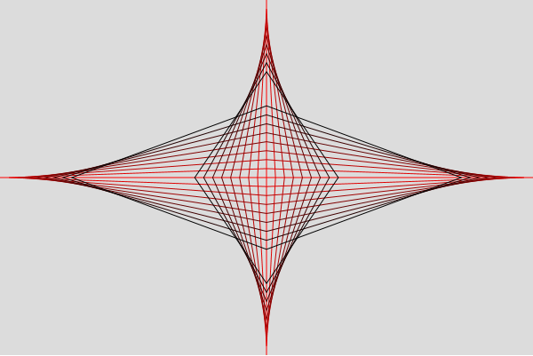
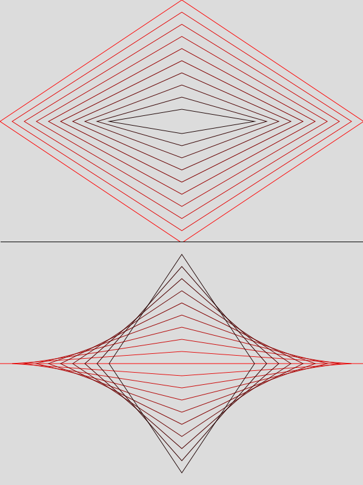

# Lesson 4

1. [Loops are a powerful tool for programming](#loops)
2. [A "while" loop will repeat until a condition is met](#while)
3. [A "for" loop has a fixed number of times it will execute](#for)
4. [Loops can be nested](#nested)
5. [Loops can exit early, and skip iterations](#break)
6. [Drawing with loops can be fun!](#draw)

<br/>

### 1. Loops are a powerful tool for programming <a name="loops"></a>

So far we've been drawing lines and shapes individually using `draw()`. That function gets called over and over again with each tick of the program. It's sometimes called 
the "draw loop" but it's not the same kind of loop that we'll be learning about in this lesson. Here is a simple program to visualize it.

```javascript
let size = 0;

function setup() {
	createCanvas(800, 600);
}

function draw() {
	size = size + 10;
	if (size > 500) {
		size = 10;
	}
	rect(0, 0, size, size);
}
```

This code will draw a plain square with an origin of (0, 0) starting with a width and height of 10. As time goes on with each draw tick `size` increases by 10. 
After `size` becomes greater than 500 it resets down to 10 and does it all again. You can try it out quick in the [online editor](https://editor.p5js.org/) and see. 
This kind of looping has its place, especially when you want something to change over time.

Often though your code needs to do something multiple times *within* a function. It could be adding numbers or calculating, or it might be a need to call some other
function several times. [Loops](https://developer.mozilla.org/en-US/docs/Web/JavaScript/Guide/Loops_and_iteration) are a fundamental tool in programming that are used in most 
languages. After you understand this concept it will transfer all over.

<br/>

### 2. A "while" loop will repeat as long as a condition is true <a name="while"></a>

Loops are for executing a code block multiple times and there are basically two different flavors. A **`while`** loop allows you to executes code repeatedly as long as
the condition evaluates to `true`. It works sort of like an **`if`** statement and the syntax probably looks familiar: start with the keyword **`while`**, 
follow it with parentheses `()` for the condition, and curly braces `{}` to define the code block that executes over and over.

```javascript
let someCondition = true;
while (someCondition === true) {
	//code block to execute over and over
}
```

In the example above as long as `someCondition` is true the code block loops continuously. **It's important to make sure that the condition can and does change so that it doesn't loop infinitely.** 
That example will loop infinitely which means the program would freeze. If `someCondition` was `false` when the loop was reached then it would be skipped entirely, like an **`if`** statement. 

If instead it was written `while (someCondition === false)` then as long as `someCondition` remained `false` that loop would execute. Because even if the *value* was `false`, the 
*comparison* would be `true`.

Now what you put inside for the condition to check is as flexible as any **`if`** statement. It just needs to evaluate to either `true` or `false`. You can put in comparison operators like 
*less than* `<` or *does not equal* `!==` and you can combine them with logical operators like *and* `&&`. Any expression that results in a boolean can be used.

If you want to have a strict number of times the loop iterates you can use a counter variable like this:

```javascript
let counter = 0;
while (counter < 10) {
	counter = counter + 1;
	console.log(counter);
}
```

In this example the loop will execute exactly 10 times, printing the value for `counter` each time through. Try it for yourself and you should see in your console the numbers from 1 to 10. 
The condition only gets rechecked at the start of each time through the loop. So even though `counter` eventually reaches 10, and the condition requires that it's less than 10, it will still 
finish the loop one last time. And remember that order matters. If you swap the two lines in the loop it would instead print from 0 to 9 (still exactly 10 times). 

<br/>

### 3. A "for" loop has a fixed number of times it will execute <a name="for"></a>

The second kind of loop is a **`for`** loop. These require a couple statements within its parentheses, which is something we haven't seen before.
**`for`** loops always get their own counter to track how many times the loop will execute. First you declare its counter, then the condition to check for the counter, and the last statement
defines how fast the counter changes. A simple **`for`** loop might look something like this:

```javascript
//c means counter
for (let c = 0; c < 10; c = c + 1) {
	console.log(c); 
}
```

It starts off with the keyword **`for`**, some parentheses `()`, then curly braces `{}` to define the code block (are you seeing a pattern?). Just like a **`while`** loop, anything inside 
the code block will execute each time it loops. What's different about this counter variable though is it only exists within the loop's scope. It is not usuable after the loop is finished.

The unique part is what's inside the parentheses. Above it starts by declaring and initializing the counter `let c = 0`. Next is the condition 
`c < 10`. That's what gets checked at the start of each time through. Last is how much the counter increments by `c = c + 1`. And these statements are separated by semicolons `;`

Each of those statements can be changed to whatever is needed. You can use any (valid) name for the counter variable. The counter doesn't need to start at 0. The condition can use any 
comparison operator and any total. And the amount it increments by can be more than 1, or it can be negative. And also like the **`while`** loop you need to make sure the increment 
works with the condition so it doesn't loop infinitely. 

Changing the increment will change the number of times it loops. If the example above instead incremented by 3 like this

```javascript
for (let c = 0; c < 10; c = c + 3) {
	console.log(c); 
}
```

then the loop would print 0, 3, 6, and 9 (so 4 times total). If you kept the increment at +3 but started `c` at 1 then it would only print 1, 4, and 7 (3 total). 
So these small tweaks have different consequences.

And if it helps you read it better, the excess spaces in the statements can be trimmed: 

```javascript
for (let i=10; i>0; i=i-1) {
	console.log(i); 
}
```

<br/>

### 4. Loops can be nested <a name="nested"></a>

Every time through a loop is known as an [iteration](https://www.techopedia.com/definition/3821/iteration). It's one repetition. 

You may recall from the lessons on **`if`** statements that you can put them inside one another. The same is true with loops. You can nest loops within loops, you can include 
**`if`** statements in there if you want, all sorts of stuff. One thing to note about nested loops is that the number of times total 
that they'll run isn't the totals added together, it's the totals multiplied. So if an outer loop had 5 iterations and its inner loop had 3 then the total number of times 
would be 5 * 3, or 15 iterations. And if instead the outer loop's total was 3 and the inner was 5 it would still be 15 because 3 * 5 equals 5 * 3.

```javascript
//nested loops
for (let outer = 0; outer < 5; outer = outer + 1) {
	for (let inner = 0; inner < 3; inner = inner + 1) {
		//this code runs a total of 15 times
		console.log("outer:" + outer + " inner:" + inner);
	}
}

//non-nested
for (let first = 0; first < 5; first = first + 1) {
	//5 times
}
for (let second = 0; second < 3; second = second + 1) {
	//3 times
}
```

Now why would you want nested loops? Well first off, don't do it if you can't think of a beneficial reason. Don't write code you can't justify (unless you're testing it out or having fun!).
Some times it's the best tool for the job, and some times it's easier to think through a problem that way (even if it could be done differently). Just know that nesting loops is a possibility.

<br/>

### 5. Loops can exit early, and skip iterations <a name="break"></a>

Sometimes your code might want to check for something
inside the loop and stop the loop immediately. In that case you'd use the keyword `break`. This keyword doesn't use anything else with it besides a semicolon.

```javascript
let counter = 0;
while (counter < 10) {
	if (counter === 0) {
		break;
	}
	counter = counter + 1;
}
```

The example above shows the syntax (although it doesn't make sense why you would write a loop like that). As soon as a loop encounters the keyword `break` it exits the loop 
and execution continues outside the code block. 

In the event that you need a loop to skip one iteration but keep looping you would use the keyword `continue`. It also doesn't use other operators or anything, just a semicolon.

```javascript
let counter = 0;
while (counter < 10) {
	counter = counter + 1;
	if (counter % 2 === 0) {
		continue;
	}
	console.log(counter);
}
```

You may remember that the arithmetic operator called modulus `%` gives you the remainder when dividing two numbers. In the example above it basically means "if `counter` is 
even, skip the rest of this loop iteration and do the next one." This code will print 1, 3, 5, 7, and 9. It still iterates 10 times, but `console.log(counter);` gets skipped
on even numbers.

These keywords `break` and `continue` are part of what's known as *control flow*. **`if`** statements are also part of *control flow*. 
They enable the programmer to have more control over how the code runs. Code will always take one step at a time, and with these tools you can change a straight walk through 
instructions into something more like a dance.

**Writing code is itself an art** and there are many different ways that code can be written to get the same result. As you write more code and get better at it you'll 
discover your preferences. And your preferences might change over time.

```javascript
//this prints odd numbers 1 - 9
for (let i = 0; i < 10; i = i + 1) {
	if (i % 2 === 1) {
		console.log(i);
	}
}

//this also prints odd numbers 1 - 9
for (let i = 0; i < 10; i = i + 1) {
	if (i % 2 === 0) {
		continue;
	}
	console.log(i);
}
```

<br/>

### 6. Drawing with loops can be fun! <a name="draw"></a>

For this lesson's project it will be easier to show a quick picture of what we're aiming at than it will be to describe it.



You might already have a sense of how a loop helps accomplish this. It's a bunch of lines making up diamonds that are spaced evenly. What might be a little harder
to tell is that the color of the lines are changing from red to black. All of this will be done using a single **`for`** loop.

In the previous lesson we learned about saving our HTML in one file and our JavaScript in another. In this one we're going to pull it all into one file just to 
share another possibility. If you'd rather just use the [online editor](https://editor.p5js.org/) that's fine too, you'll simply need to exclude the HTML.

To start off make a new text file with this code and save it as `diamonds.html`

```html
<html>
<head>
	<title>Diamonds</title>
	<!-- Fetch p5 from the Content Delivery Network (cdn) -->
	<script src="https://cdn.jsdelivr.net/npm/p5"></script> 
</head>
<body>
<script>
	function setup() {
		createCanvas(1000, 800);
	}

	function draw() {
		background(220);
	}
</script>
</body>
</html>
```

All our JavaScript needs to be within the `<script>` tags. This is a very simple base for making a sketch that can be opened by itself in a browser.
You can change the canvas size and background color to something else if you prefer.

I prefer using variables that scale with the canvas so we're going to make a `centerX` and `centerY`. In this sketch I'm going to make them global so that they
aren't recreated each time through the `draw()` loop. The program wouldn't behave any differently if we did, but sometimes I like to give the computer a rest.

Let's start by getting a single diamond on the screen. It can be created using 4 separate lines, but it's shorter to use [`quad()`](https://p5js.org/reference/#/p5/quad).
We're going to use [`noFill()`](https://p5js.org/reference/#/p5/noFill) so that the shape doesn't get painted in and only the stroke lines show.

```javascript
let centerX, centerY;

function setup() {
	createCanvas(1000, 800);
	noFill(); //don't paint in the quad()s
	centerX = width / 2;
	centerY = height / 2;
}

function draw() {
	//paint the canvas
	background(220);

	//draw a diamond
	quad(0, centerY, //west
		centerX, 0, //north
		width, centerY, //east
		centerX, height); //south
}
```

I've split the call to `quad()` into separate lines so that it's easier to read. JavaScript's syntax is flexible like that. It's also perfectly fine to write it out as 
`quad(0, centerY, centerX, 0, width, centerY, centerX, height);`

Now lets add the loop and make more diamonds. We need another variable to calculate the padding in each loop iteration.

```javascript
function draw() {
	//paint the canvas
	background(220);

	let pad;
	for (let i = 0; i <= 10; i++) {
		pad = i * 20; //20 is the distance between diamonds

		//draw diamond
		quad(0 + pad, centerY, //west
			centerX, 0 + pad, //north
			width - pad, centerY, //east
			centerX, height - pad); //south
	}
}
```

Now we have a bunch of diamonds that get progressively smaller. Let's fade them from red to black. We're going to need another variable to calculate the percentage complete that the loop
is at. This will help us fade the color. When the loop is 0% complete (during the first iteration) the color will be fully red. At 100% completion (the last loop) it should be 
fully black. Also since `0 + pad` is the same as just writing `pad` we'll take out the zeroes.

```javascript
function draw() {
	//paint the canvas
	background(220);

	let pad, loopPercentage;
	for (let i = 0; i <= 10; i++) {
		pad = i * 20; //20 is the distance between diamonds

		//as the loop progresses the color gets darker
		loopPercentage = i / 10;
		stroke(255 - (loopPercentage * 255), 0, 0);

		//draw diamond
		quad(pad, centerY, //west
			centerX, pad, //north
			width - pad, centerY, //east
			centerX, height - pad); //south
	}
}
```

There's a subtle difference between how it's written now and how the end result should be. Currently it's drawing from the edge of the canvas going in. I want it to draw from the center
going out. So we'll have to change how the quad is written.

```javascript
quad(pad, centerY, //west
	centerX, centerY - pad, //north
	width - pad, centerY, //east
	centerX, centerY + pad); //south
```

This small change to the north and south points has a big effect on how it looks. It's much cooler now in my opinion. Here's the before and after:



Alright we've got the horizontal diamonds. The vertical diamonds are just another call to `quad()` away.

```javascript
function draw() {
	//paint the canvas
	background(220);

	let pad, loopPercentage;
	for (let i = 0; i <= 10; i++) {
		pad = i * 20; //20 is the distance between diamonds

		//as the loop progresses the color gets darker
		loopPercentage = i / 10;
		stroke(255 - (loopPercentage * 255), 0, 0);

		//horizontal diamonds
		quad(pad, centerY, //west
			centerX, centerY - pad, //north
			width - pad, centerY, //east
			centerX, centerY + pad); //south

		//vertical diamonds
		quad(centerX, pad, //north
			centerX + pad, centerY, //east
			centerX, height - pad, //south
			centerX - pad, centerY); //west
	}
}
```

Sweet. But what if we wanted the padding distance to change? We can tie that to our mouse position by adding in another variable. It will calculate the y (vertical) distance from
the center of the canvas. I'm going also divide it by 10 (which is arbitrary) so that the change isn't so dramatic. Try setting 10 to something else, or removing it entirely, to see what I mean.

Then since we're adding in mouse interaction I want one more tweak. I'm going to add an **`if`** statement around the call to `background()` so that if a mouse button is held down we'll
skip repainting the canvas. Clicking and dragging the mouse will make it look all glitchy. That will be even more fun.

### Complete sketch

```javascript
let centerX, centerY;

function setup() {
	createCanvas(1000, 800);
	noFill(); //don't paint in the quad()s
	centerX = width / 2;
	centerY = height / 2;
}

function draw() {
	//if we're not pressing down a mouse button, then repaint the canvas grey
	if (!mouseIsPressed) {
		background(220);
	}

	let pad, loopPercentage;
	let distance = abs(centerY - mouseY) / 10; //calculate mouse distance from the center

	for (let i = 0; i <= 10; i++) {
		pad = i * distance;

		//as the loop progresses the color gets darker
		loopPercentage = i / 10;
		stroke(255 - (loopPercentage * 255), 0, 0);

		//horizontal diamonds
		quad(pad, centerY, //west
			centerX, centerY - pad, //north
			width - pad, centerY, //east
			centerX, centerY + pad); //south

		//vertical diamonds
		quad(centerX, pad, //north
			centerX + pad, centerY, //east
			centerX, height - pad, //south
			centerX - pad, centerY); //west
	}
}
```

Loops are pretty cool huh?! The only other thing I didn't mention is that `distance` is calculated using a function called [`abs()`](https://p5js.org/reference/#/p5/abs). 
This gives you the absolute value of a number, meaning it's always positive. There are a bunch more math related functions available, just 
[check out the reference](https://p5js.org/reference/).

<br/>

:alien: